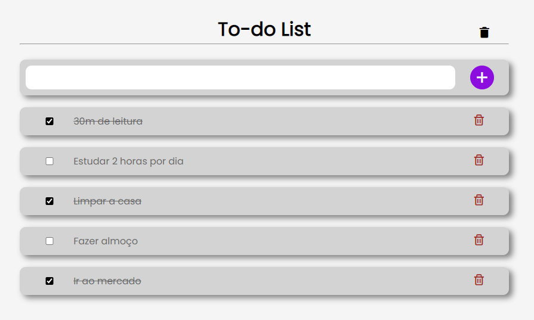

<h1 align="center">To-do List </h1>

Estudando e aplicando a to-do list com javascript.  

## 🚀 Tecnologias

- HTML, CSS e Javascript

 

 [Clique aqui para acessar] (https://emmanuel194.github.io/To-do-list/)
  

